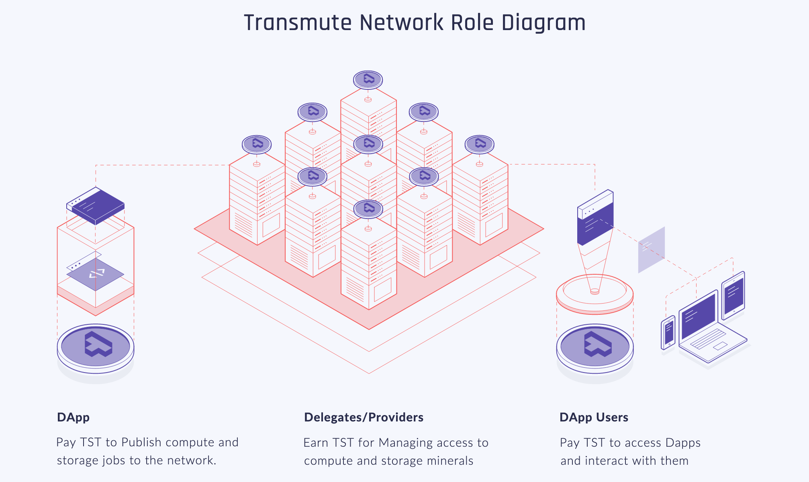

# Transmute Network Contracts [](https://travis-ci.org/transmute-industries/network-contracts) [](https://coveralls.io/github/transmute-industries/network-contracts?branch=master)

This repo contains smart contracts that are under development for Network part of the Transmute Platform: A marketplace for decentralized storage. For more information information, check out our [Whitepaper](https://www.transmute.industries/whitepaper.pdf)




Check out the [wiki](https://github.com/transmute-industries/network-contracts/wiki) for more info!


# Run the project locally

## Install the project

```
npm install
```

## Run the tests

```
npm run ganache # in a separate shell
```

### Running the unit tests of every smart contract

```
npm run test:unit
```

### Running the integration test of the Delegated Proof of Stake consensus in action

```
npm run test:integration
```
